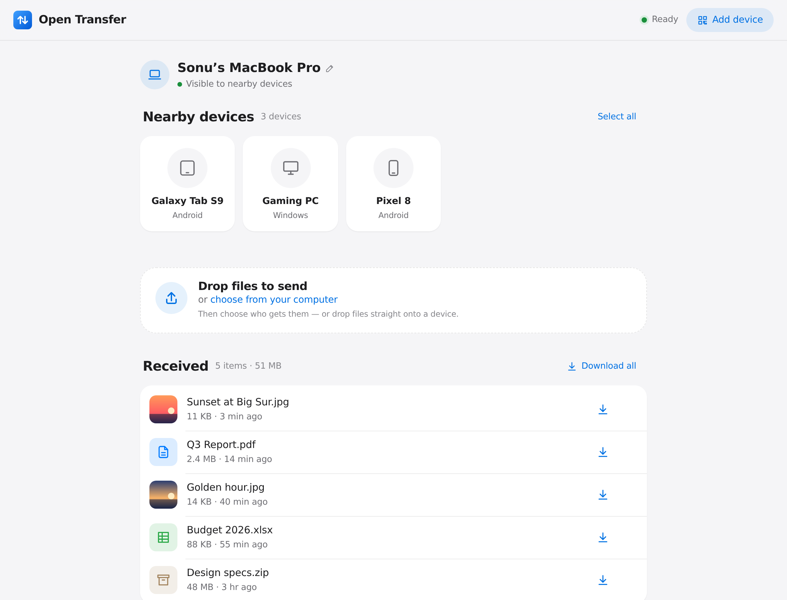
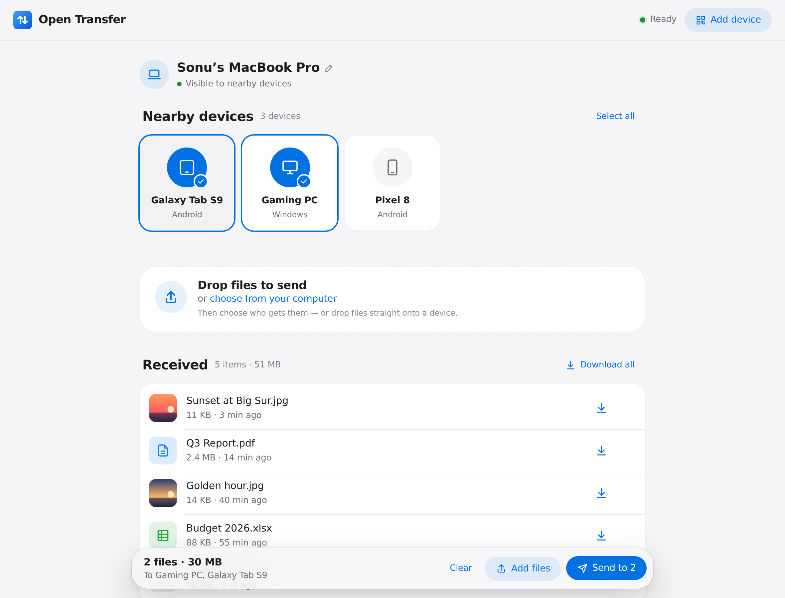
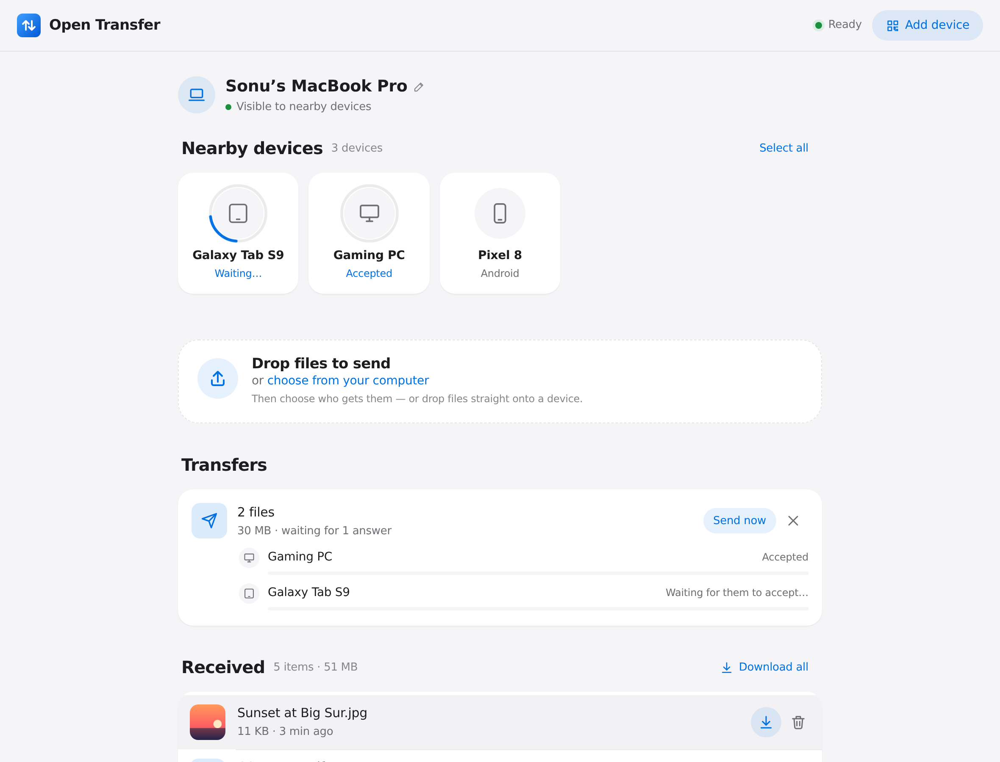
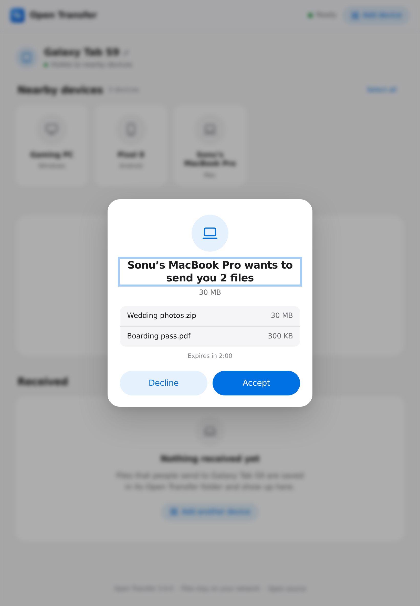
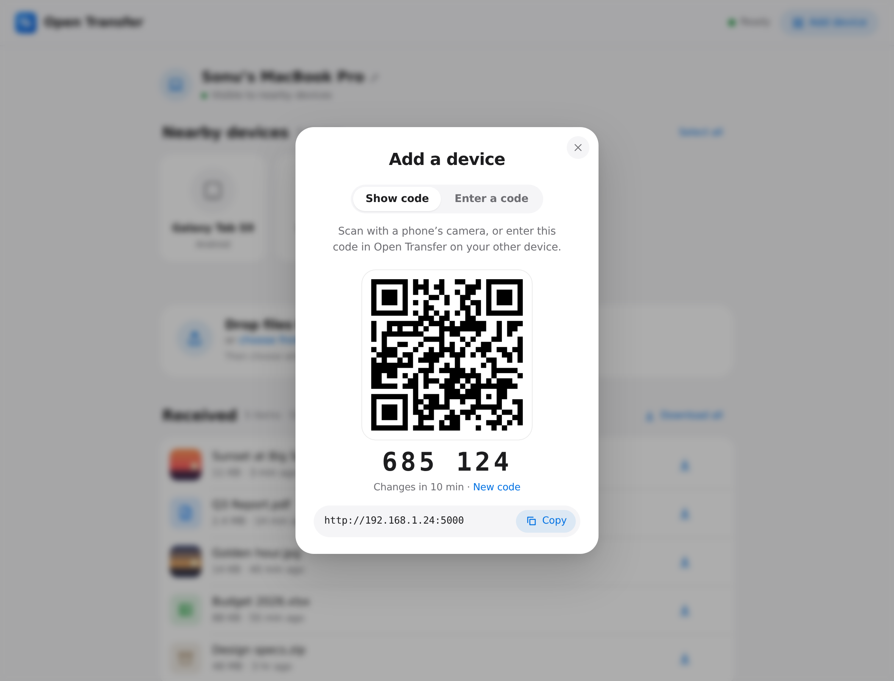
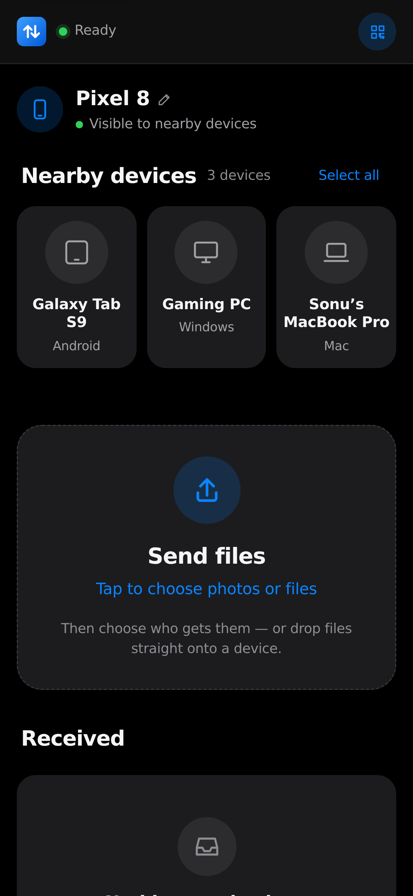
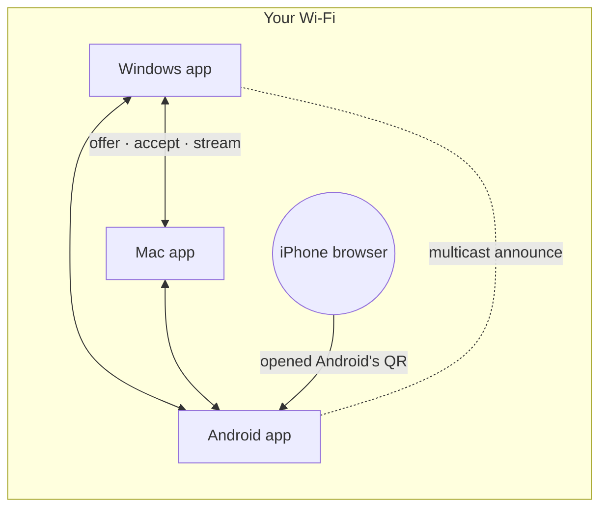

<div align="center" markdown="1">


# Open Transfer

**AirDrop for every device.** Your Windows PC, Mac, Android phone and Samsung tablet find each other on the same Wi‑Fi — pick one, several or all of them and send. Files go straight from device to device. No account, no cloud. Devices without the app can join from any browser by scanning a QR code.

**[Website](https://itsonu.github.io/open-transfer/)** · **[Download](https://github.com/itsonu/open-transfer/releases/latest)** · **[Docs](docs/architecture.md)**

[](https://github.com/itsonu/open-transfer/actions/workflows/ci.yml)
[](https://github.com/itsonu/open-transfer/actions/workflows/security.yml)
[](LICENSE)




</div>

---

## Contents

- [Why Open Transfer](#why-open-transfer)
- [Quick start](#quick-start)
- [How it works](#how-it-works-for-your-users)
- [Features](#features)
- [Screenshots](#screenshots)
- [Configuration](#configuration)
- [Security & privacy](#security--privacy)
- [Self-hosting & Docker](#self-hosting--docker)
- [Architecture](#architecture)
- [Development](#development)
- [Troubleshooting](#troubleshooting)
- [Roadmap](#roadmap)
- [Contributing](#contributing) · [License](#license)

## Why Open Transfer

|                       | Open Transfer | AirDrop | Cloud drives |
| --------------------- | :-----------: | :-----: | :----------: |
| Windows ↔ Mac ↔ Android ↔ tablets, in any direction | ✅ | Apple only | ✅ |
| Finds nearby devices automatically, sends to the ones you pick | ✅ | ✅ | ❌ |
| Device to device — files never leave your network | ✅ | ✅ | ❌ |
| Works on devices without the app (any browser, via QR code) | ✅ | ❌ | ✅ |
| No account, no size caps, no subscription | ✅ | ✅ | ❌ |
| Open source, self-hostable, scriptable (curl) | ✅ | ❌ | ❌ |

## Quick start

### Option 1 — Download the app (no Python needed)

Install it on each device from the [latest release](https://github.com/itsonu/open-transfer/releases/latest). Open it on two devices on the same Wi‑Fi and they appear in each other's **Nearby devices**.

| Device | File | First launch |
| ------ | ---- | ------------ |
| **Windows 10/11** (x64) | `open-transfer-windows-x64.exe` | SmartScreen may warn about an unknown publisher → **More info → Run anyway**. Allow **Private networks** when the firewall asks (needed to be found). |
| **macOS 11+** Apple silicon | `open-transfer-macos-arm64.dmg` | Open the .dmg, drag **Open Transfer** to Applications. The app isn't notarised yet: the first time, **right-click → Open** (or System Settings → Privacy & Security → **Open Anyway**). Allow **local network** access when asked. |
| **macOS 11+** Intel | `open-transfer-macos-x64.dmg` | Same as above. |
| **Android 10+** phones & tablets (incl. Samsung Galaxy Tab) | `open-transfer-android.apk` | Allow installing from your browser/Files app when Android asks ("Install unknown apps"). Allow notifications so you see incoming files. 64-bit devices only. |
| **Linux** (x64, command line) | `open-transfer-linux-x64.tar.gz` | `tar -xzf open-transfer-linux-x64.tar.gz && ./open-transfer` — opens in your browser |

Received files go to **Downloads/Open Transfer** on every platform.

**iPhone / iPad, or a device you can't install on?** Open the link or scan the QR code shown under **Add device** on any device that runs the app. The browser joins the group and can send and receive (through that device).

**Build the apps yourself** (Python 3.10+, on the OS you want it for):

```bash
python3 scripts/build_app.py --desktop   # Windows: dist/Open Transfer.exe · macOS: dist/open-transfer-macos-<arch>.dmg
python3 scripts/build_app.py             # the single-file command-line build
gradle -p android assembleRelease        # Android (needs the Android SDK; see android/README.md)
```

CI builds every platform on each run (downloadable from the run's *Artifacts*) and smoke-tests them: the desktop apps open their real window, and the Android app receives a real transfer in an emulator.

### Option 2 — Run from source

You need **Python 3.10+** ([download](https://www.python.org/downloads/)). Everything else is installed for you in a private `.venv` folder on first run.

**macOS / Linux**

```bash
git clone https://github.com/itsonu/open-transfer.git
cd open-transfer
./run.sh
```

**Windows (PowerShell)**

```powershell
git clone https://github.com/itsonu/open-transfer.git
cd open-transfer
.\run.ps1
```

Your browser opens and the terminal shows the address and a QR code:

```
  Open Transfer  v3.0.0

  This device        Studio-Mac  · visible to nearby devices
  On this computer   http://localhost:5000
  On your network    http://192.168.1.24:5000
  Saving files to    /Users/you/open-transfer/uploads

  Scan with your phone's camera:
  ▄▄▄▄▄▄▄ ▄ ▄▄ ▄▄▄▄▄▄▄
  █ ▄▄▄ █ ▀█▄▀ █ ▄▄▄ █   …
```

<details markdown="1">
<summary><b>Other ways to run it</b> — pipx, Docker, standalone binary</summary>

| Method | Command |
| ------ | ------- |
| **pipx / uv** (installs the `open-transfer` command) | `pipx install git+https://github.com/itsonu/open-transfer` or `uv tool install git+https://github.com/itsonu/open-transfer` |
| **Docker** | `docker compose up -d` (see [Self-hosting](#self-hosting--docker)) |
| **Standalone app** (no Python needed) | See [Option 1](#option-1--download-the-app-no-python-needed), or build it with `python3 scripts/build_app.py` |
| **From source, manually** | `python -m venv .venv && .venv/bin/pip install -e . && .venv/bin/open-transfer` |

</details>

**Common recipes**

```bash
./run.sh ~/Desktop/Inbox          # save received files somewhere else
./run.sh --name "Studio Mac"      # the name other devices see
./run.sh --paired-only            # only accept files from paired devices
./run.sh --peer 192.168.1.30:5000 # connect directly where discovery is blocked
./run.sh --pin                    # browsers joining by link need a PIN
./run.sh ~/Share --share-folder   # classic mode: anyone with the link sees the folder
```

> Put the folder **before** `--pin` — `--pin` takes an optional value, so `--pin ~/Share` would treat the path as the PIN.

## How it works for your users

1. **Open** Open Transfer on your devices. Each one shows the others under **Nearby devices** within a second or two.
2. **Pick** who gets the files — tap one device, several, or **Select all** — and choose or drop files. (Or drop files straight onto a device.) Sending to everyone asks you to confirm first.
3. **Accept** on the other side: "Gaming PC wants to send you 3 files". Paired devices skip this step.

Any device can send to any other — there's no host or server role. A phone without the app scans the QR code under **Add device** and joins from its browser.

**Pairing** (optional): on one device open **Add device** to see a QR code and a 6-digit code; on the other choose **Enter a code** (or **Scan its QR code** in the Android app). Paired devices accept each other's files automatically and stay listed when they're away.

## Features

**Nearby devices**
- **Automatic discovery** on the local network (UDP multicast), with presence updates every few seconds and an instant "gone" when a device closes
- Each device shows its **name, type and platform**; rename yours in one tap
- Send to **one, several or all** devices; recipients are always shown before you send, and sending to everyone needs a confirmation
- **Accept / Decline** prompt on the receiver with the sender, file names and sizes; offers expire after 2 minutes
- **Pairing** with a QR code or 6-digit code (proved with HMAC, never sent in clear); paired devices auto-accept
- **Paired-only** mode (like AirDrop's "Contacts only"), and add-by-address where multicast is blocked
- Browsers without the app join a device's group by QR code and can send and receive too — **browser to browser goes direct** over WebRTC (falls back to the app if the network blocks it). Add the page to the home screen to use it like an app.

**Transfers**
- **Device to device**: one upload is streamed to every receiver at the same time — nothing is staged on disk
- Multiple files, **no size limit** except free space; live progress per recipient with speed and time left
- Cancel per recipient or all, **retry** the ones that failed, "send now" to the ones that already accepted
- A device leaving or losing Wi‑Fi mid-transfer only affects its own transfer; the rest continue
- Received files land in **Downloads/Open Transfer**; duplicates are kept as `photo (1).jpg`; Unicode names work
- Paste (⌘V / Ctrl+V) screenshots and files; drag and drop anywhere

**Experience**
- Clean, native-feeling interface with automatic **dark mode**, fluid motion that respects **Reduce Motion**, and layouts tuned for phones, tablets and desktops
- Native windows on Windows and macOS, a native shell on Android (file picker, QR scanner, notifications)
- Clear states everywhere: looking-for-devices radar, waiting / accepted / sending / delivered per device, reconnecting indicator, errors with reasons
- Accessible: keyboard operable, visible focus, screen-reader labels, live regions
- Works fully **offline on a LAN** — no CDNs, fonts or trackers

**Operating it**
- One-command start on macOS, Linux and Windows; free-port fallback (macOS uses 5000 for AirPlay)
- Optional **PIN** for browsers joining by link, with brute-force rate limiting
- Classic **shared-folder** mode (`--share-folder`) with receive-only / read-only / no-delete, undo, search and ZIP download
- Docker image as an always-on hub, reverse-proxy support, and a documented [HTTP API](docs/api.md) and [device protocol](docs/protocol.md)

## Screenshots

| Nearby devices | Choose who gets it | Per-device progress |
| :---: | :---: | :---: |
|  |  |  |

| Accept on the tablet | Add a device (QR + code) | Phone, dark mode |
| :---: | :---: | :---: |
|  |  |  |

Screenshots are generated from the real app by [`scripts/screenshots.py`](scripts/screenshots.py).

## Configuration

Every option works as a command-line flag or an environment variable (flags win).

| Flag | Environment variable | Default | What it does |
| ---- | -------------------- | ------- | ------------ |
| `DIRECTORY` | `OPEN_TRANSFER_DIR` | `./uploads` (apps: `~/Downloads/Open Transfer`) | Where received files are saved |
| `--name` | `OPEN_TRANSFER_NAME` | host name | Name other devices see (can also be changed in the app) |
| `--form` | `OPEN_TRANSFER_FORM` | `computer` | `computer`, `phone` or `tablet` — the icon others see |
| `--peer HOST:PORT` | `OPEN_TRANSFER_PEERS` (comma-separated) | — | Connect to an app directly (networks that block discovery) |
| `--no-discovery` | `OPEN_TRANSFER_NO_DISCOVERY=1` | off | Don't announce this device or look for others |
| `--paired-only` | `OPEN_TRANSFER_PAIRED_ONLY=1` | off | Only accept files from paired devices |
| `--auto-accept` | `OPEN_TRANSFER_AUTO_ACCEPT=1` | off | Accept incoming files without asking (servers) |
| `--share-folder` | `OPEN_TRANSFER_SHARE_FOLDER=1` | off | Classic mode: anyone who opens the link can browse the folder |
| — | `OPEN_TRANSFER_DISCOVERY_PORT` | `47823` | UDP port for discovery |
| `-p, --port` | `OPEN_TRANSFER_PORT` | `5000` | Port (the next free one is used if it's busy) |
| `--host` | `OPEN_TRANSFER_HOST` | `0.0.0.0` | Interface to listen on; `127.0.0.1` = this computer only |
| `--pin [PIN]` | `OPEN_TRANSFER_PIN` | off | Require a PIN (4–32 letters/digits). No value = random 4 digits |
| `--max-size` | `OPEN_TRANSFER_MAX_SIZE` | unlimited | Largest single upload, e.g. `500M`, `4G`, `2GiB` |
| `--receive-only` | `OPEN_TRANSFER_RECEIVE_ONLY=1` | off | Shared-folder mode: visitors can send but not see files |
| `--read-only` | `OPEN_TRANSFER_READ_ONLY=1` | off | Visitors can't send (shared-folder mode: download only) |
| `--no-delete` | `OPEN_TRANSFER_NO_DELETE=1` | off | Shared-folder mode: visitors can't delete files |
| `--public-url` | `OPEN_TRANSFER_PUBLIC_URL` | auto | Address shown in the QR code (Docker, proxies, DNS names) |
| `--allow-host NAME` | `OPEN_TRANSFER_ALLOWED_HOSTS` (comma-separated) | — | Extra host names to accept (see [DNS rebinding](#security--privacy)); `*` disables the check |
| `--behind-proxy` | `OPEN_TRANSFER_BEHIND_PROXY=1` | off | Trust `X-Forwarded-*` from one reverse proxy |
| `--no-browser` | `OPEN_TRANSFER_NO_BROWSER=1` | off | Don't open a browser on start |
| `--no-qr` | `OPEN_TRANSFER_NO_QR=1` | off | Don't print the QR code |
| `-v, --verbose` | — | off | Log every request |

## Security & privacy

Open Transfer is designed for **trusted local networks** (home, office, a hotspot you control).

**What it does for you**
- Files go directly between devices on your network. Nothing is sent to any third party; the page loads no external resources.
- **Nothing arrives without consent**: every transfer is offered first and the receiver accepts or declines — except from devices you paired, or with `--auto-accept`.
- **Pairing** never sends the code: both sides prove they know it (HMAC challenge–response), then share a key that signs their requests (replays refused). Wrong codes are rate-limited and the code changes after use and every 10 minutes.
- A device's own files are only visible on that device. Browsers that join see the device list and the files sent *to them*.
- **PIN mode** protects the page, file list, downloads and uploads. Wrong PINs are rate-limited (5 per minute per device). Sessions are signed cookies (`HttpOnly`, `SameSite=Lax`) and become invalid if you change the PIN.
- **Path traversal** is impossible: names are sanitised (`../../etc/passwd` → `passwd`), hidden files and symlinks are never served, and every path is checked to be inside the shared folder.
- **Cross-site request forgery** is blocked: browsers can only upload or delete from the Open Transfer page itself.
- **DNS rebinding** is blocked: requests must address the server by IP, `localhost`, a `.local`/`.lan`-style name, this computer's name, or a name you allow with `--allow-host`.
- A strict **Content-Security-Policy** and other hardening headers; shared files are always served as downloads (never rendered as HTML), with a sandbox CSP.
- Half-finished uploads are never visible and are cleaned up automatically.

**What you should know**
- Anyone on the same network can see your device's **name** and offer you files (you decide). Use `--paired-only` on shared or public Wi‑Fi, and `--pin` to keep strangers' browsers out.
- **Traffic between devices is plain HTTP on your LAN — not encrypted.** Someone able to capture your Wi‑Fi traffic could read files in transit. Use networks you trust. (TLS with per-device certificates is on the roadmap.)
- In `--share-folder` mode without a PIN, anyone who opens the link can see, download and delete the folder's files.
- It is not meant to be exposed directly to the internet.

Found a vulnerability? Please report it privately — see [SECURITY.md](SECURITY.md).

## Self-hosting & Docker

```bash
docker compose up -d        # builds the image and serves ./uploads on port 5000
```

Or use the image published with each release, without cloning:

```bash
docker run -d --name open-transfer -p 5000:5000 -v "$PWD/uploads:/data" \
  -e OPEN_TRANSFER_PUBLIC_URL=http://192.168.1.24:5000 ghcr.io/itsonu/open-transfer
```

The image acts as an always-on hub: browsers that open it see the shared folder, and files apps send to it are accepted automatically (`OPEN_TRANSFER_SHARE_FOLDER=1`, `OPEN_TRANSFER_AUTO_ACCEPT=1`). Discovery needs the host network (`network_mode: host`, the compose default; Linux). Otherwise set `OPEN_TRANSFER_PUBLIC_URL` so the QR code points to the right place, and add the server in your apps by address. The image runs as a non-root user and has a built-in health check.

HTTPS with Caddy or nginx, running as a systemd service, and NAS tips: **[docs/self-hosting.md](docs/self-hosting.md)**.

## Architecture

Every device runs the same small Python program: an HTTP server, discovery, and the web UI. Apps talk to each other directly; browsers without the app join through the device whose link they opened.



| Module | Responsibility |
| ------ | -------------- |
| `node.py` / `cli.py` / `desktop.py` / `android.py` | Start a device: CLI, native desktop window, or the Android app's Python side |
| `discovery.py` | Multicast announce / reply / find / bye |
| `mesh.py` | Nearby devices, visitors, offers, one-to-many streaming, pairing |
| `mesh_api.py` | App↔app protocol (`/api/p2p/v1`) and the UI's device endpoints |
| `devices.py` | Device identity, paired devices, signatures, pairing proofs |
| `app.py`, `storage.py`, `security.py` | Flask app, safe streaming storage, host/origin/PIN guards |
| `static/`, `templates/` | The web UI: vanilla ES modules + CSS, no build step |
| `android/` | Kotlin shell: WebView, file picker, QR scanner, foreground service |

Details: **[docs/architecture.md](docs/architecture.md)** · wire format: **[docs/protocol.md](docs/protocol.md)**.

## Development

```bash
make setup     # venv + dev tools + git hooks + Playwright Chromium
make dev       # run on a scratch folder with request logging
make check     # everything CI runs: lint, types, unit + browser tests
```

| Command | What it does |
| ------- | ------------ |
| `make test` | Unit & API tests (pytest) |
| `make e2e` | Real-browser tests with Playwright against a live server |
| `make lint` / `make fmt` | Ruff lint + format, JS syntax check |
| `make typecheck` | mypy (strict) |
| `make audit` | Dependency vulnerability scan (pip-audit) |
| `make cov` | Coverage report |
| `make docker` / `make app` | Container image / standalone app (`scripts/build_app.py`) |

The front end is plain HTML, CSS and ES modules in `src/open_transfer/static/` — edit and reload, no bundler. To try several devices on one machine, start more copies with their own folders: `open-transfer /tmp/a --name A` and `open-transfer /tmp/b --name B --port 5001` find each other. CI runs on Linux, macOS and Windows across Python 3.10–3.14, plus browser tests, a Docker smoke test, CodeQL and dependency audits.

## Troubleshooting

<details markdown="1">
<summary><b>Devices don't see each other</b></summary>

- Both must be on the **same Wi‑Fi** network. Guest networks and many routers isolate devices ("AP/client isolation"); mesh Wi‑Fi and VPNs can block multicast.
- Allow Open Transfer through the firewall: **Windows** asks on first run — tick *Private networks*. **macOS** asks for *Local Network* access (System Settings → Privacy & Security → Local Network). **Linux**: `sudo ufw allow 5000/tcp && sudo ufw allow 47823/udp`.
- Still nothing? Pair with **Add device → Enter a code** and open *Not found? Enter its address* (the address is shown on the other device), or start with `--peer IP:PORT`.
</details>

<details markdown="1">
<summary><b>My phone can't open the link</b></summary>

- Make sure both devices are on the **same Wi‑Fi**. Guest networks and some routers isolate devices from each other ("AP/client isolation").
- Allow Python through your firewall. **Windows** asks on first run — tick *Private networks*. **macOS**: System Settings → Network → Firewall → allow *python*. **Linux (ufw)**: `sudo ufw allow 5000/tcp`.
- If the computer has several network adapters (VPN, Docker, virtual machines), try the other addresses listed under **Add a device → Other addresses**.
</details>

<details markdown="1">
<summary><b>"Port 5000 is busy, using 5001 instead"</b></summary>

On macOS, AirPlay Receiver uses port 5000. Open Transfer picks the next free port automatically — use the address it prints, or choose one with `--port 8080`.
</details>

<details markdown="1">
<summary><b>"Requests for '…' are not accepted"</b></summary>

You're reaching the server by a host name it doesn't recognise (DNS-rebinding protection). Start it with `--allow-host that.name` or use the IP address.
</details>

<details markdown="1">
<summary><b>Uploads fail behind nginx</b></summary>

nginx limits request bodies to 1 MB by default. Set `client_max_body_size 0;` and `proxy_request_buffering off;` — see [docs/self-hosting.md](docs/self-hosting.md).
</details>

## Roadmap

- [ ] Encrypted transfers (TLS with per-device certificates, pinned at pairing)
- [ ] Folder transfers that keep their structure; resumable transfers
- [ ] "Share to Open Transfer" from other Android apps; iOS app
- [ ] Signed/notarised desktop builds, Play Store / F-Droid
- [ ] Share text snippets and links, not just files
- [ ] Translations (i18n)

Have an idea? [Open a feature request](https://github.com/itsonu/open-transfer/issues/new/choose).

## Contributing

Contributions of all sizes are welcome — bug reports, docs, design polish and code. Start with **[CONTRIBUTING.md](CONTRIBUTING.md)**; it takes about two minutes to get a dev environment running (`make setup`). Please follow our [Code of Conduct](CODE_OF_CONDUCT.md).

## License

[MIT](LICENSE) © Open Transfer contributors · Maintained by [Chandrabhushan Prakash](https://techsoftsk.vercel.app/)
