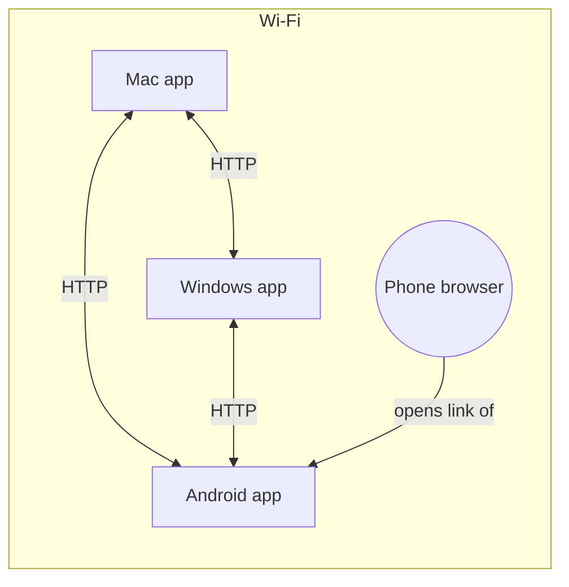

# Nearby-device protocol (v1)

How Open Transfer apps find each other, pair, and send files **directly** to
the devices a person picks. Anything that speaks this protocol can join a
network of Open Transfer devices — the desktop apps, the Android app and the
CLI all run the same Python implementation (`discovery.py`, `mesh.py`,
`mesh_api.py`).

## Roles

| Term | Meaning |
| ---- | ------- |
| **app** | A device running Open Transfer. Has a stable id (`d-` + 24 hex), an HTTP server, and announces itself. |
| **owner** | The person using an app on that device — requests from `127.0.0.1`. Accepts or declines incoming files. |
| **visitor** | A browser on a device *without* the app (opened an app's link / QR code). Gets an id `w-…` in a signed session cookie. The app it opened sends and receives on its behalf. |



Apps talk to each other directly. A visitor's files travel visitor → its app
→ receiver (one hop through the app it is connected to).

## 1. Discovery (UDP multicast)

* Group `239.255.77.77`, port `47823` (admin-scoped, TTL 1 — never leaves the LAN).
* Every app sends an **announce** on start (3× within 1.5 s), then every ~4 s,
  and a **bye** when it stops. When it sees a new app it answers with a
  **reply** (at most once a second) and says hello over HTTP (§2).
* Datagrams are UTF-8 JSON, at most 1400 bytes:

```json
{"app": "open-transfer", "v": 1, "type": "announce",
 "id": "d-3f…", "name": "Sonu’s MacBook", "form": "computer", "platform": "macos",
 "port": 5000, "rev": 7, "ver": "3.0.0"}
```

`type` is `announce` | `reply` | `find` | `bye`. The peer's address is the
datagram's **source IP**, never a field in the packet. `rev` changes when the
app's visitors or name change, prompting others to fetch its info.

**find** — "whoever is showing this pairing code, answer":
`{"type": "find", "id": "d-…", "find": "<hint>"}` where
`hint = sha256("open-transfer-find/1\n" + code)[:16]`. The app showing that
code sends a `reply` with `"found": "<hint>"`.

Multicast is often blocked (guest Wi-Fi, some routers, Docker). So apps also:

* say **hello** over HTTP to every known app every 6 s (keeps presence alive
  even if multicast only works one way), and
* can be added by address (`POST /api/devices`, `--peer HOST:PORT`).

An app is *nearby* while it was heard from in the last 15 s; unpaired apps are
forgotten after 2 minutes, paired ones stay listed as "Not nearby".

## 2. App ↔ app HTTP API

All under `/api/p2p/v1`, JSON unless noted. No PIN is needed (the PIN guards
the web UI); every transfer still needs the receiver's consent. Requests
between **paired** apps carry a signature (§4).

| Request | Purpose |
| ------- | ------- |
| `GET /info` | `{id, name, form, platform, port, version, accepts, visitors: [{id, name, form, platform}]}` (visitors hidden when a PIN is set and the caller isn't paired) |
| `POST /hello` body = caller's info | Registers the caller (address = TCP peer address); returns `/info` |
| `POST /offers` | Offer files (below) → `201 {id, secret, state}` |
| `GET /offers/<id>` + `X-OT-Secret` | `{state, reason, files: [{state, received}]}` |
| `PUT /offers/<id>/files/<n>` + `X-OT-Secret`, `Content-Length` | Raw file bytes → `201 {file}` |
| `DELETE /offers/<id>` + `X-OT-Secret` | Sender cancels |
| `POST /pair`, `POST /pair/confirm` | Pairing (§3) |

### Offer

```json
POST /api/p2p/v1/offers
{"from":   {"id": "d-sender…", "name": "Gaming PC", "form": "computer", "platform": "windows", "port": 5000},
 "origin": {"id": "w-visitor…", "name": "Pixel 8", "form": "phone", "platform": "android"},
 "to":     "d-receiver…",
 "files":  [{"name": "IMG_0001.jpg", "size": 2481331, "mime": "image/jpeg"}]}
```

* `from` is the app making the request; `origin` is who is actually sending
  (the app's owner, or one of its visitors).
* `to` is the receiving app's own id (its owner) **or one of its visitors**.
* Names are sanitised by the receiver; sizes are checked against free space
  and `--max-size` up front (`state: "declined"` with a reason if they don't fit).

**States:** `pending` → `accepted` → `receiving` → `done`, or `declined`,
`expired` (no answer in 120 s), `canceled`, `failed`. Offers to an owner from
a paired app (and with `--auto-accept`) start as `accepted`. With
`--paired-only`, offers from unpaired apps are refused (`403`).

The sender polls `GET /offers/<id>` until it leaves `pending`, then uploads
each file with `PUT`. The receiver streams it to a `.part` file and publishes
it atomically; the byte count must equal the offered size. If the receiver
cancels, further reads fail and the upload gets `410`.

### One-to-many

The sender's own browser uploads each file **once** to its app
(`PUT /api/send/<job>/files/<n>`). The app streams the bytes to every
accepting receiver at the same time — each receiver has its own thread and a
bounded queue; a receiver that takes no data for 60 s is dropped without
stalling the others. Nothing is staged on the sender's disk.

## 3. Pairing

Pairing proves both apps know the same short-lived 6-digit code **without
sending it**, and leaves them with a shared 32-byte key. A is the app showing
the code, B the one entering it.

```
B → A  POST /pair          {device: B-info, nonce: nb}
A → B                       {nonce: na, device: A-info}
B → A  POST /pair/confirm  {id: B, proof: HMAC(code, "b"|na|nb|A|B)}
A → B                       {proof: HMAC(code, "a"|na|nb|A|B)}
key = HMAC(code, "key"|na|nb|A|B)
```

(Each HMAC is SHA-256 over `"open-transfer-pair/1\n<label>\n<na>\n<nb>\n<idA>\n<idB>"`.)
A rate-limits confirmations (5 per minute per address) and shows a new code
after 10 wrong guesses, after every successful pairing, and every 10 minutes.
B verifies A's proof too, so both sides authenticate. Keys are stored in
`<state>/trusted.json` (mode 0600).

The QR code in "Add a device" is `http://<ip>:<port>/?pair=<code>` (+ `&pin=`).
The Android app scans it and pairs as above; a phone camera simply opens it,
which signs that browser in as a **trusted visitor** (its sends to the owner
are accepted automatically).

## 4. Signed requests

Requests from a paired app carry:

```
X-OT-From: d-sender…
X-OT-Auth: <unix time>:<hex HMAC-SHA256(key, "open-transfer/1\n<time>\n<METHOD>\n<path>\n<sender>\n<sha256(body)>")>
```

Receivers accept signatures within ±120 s and refuse a signature they have
already seen. A valid signature makes an offer from that app's owner
auto-accepted; anything else is treated as a stranger (asked first).

## Security notes and limits

* **Transport is plain HTTP on the LAN.** Pairing authenticates devices and
  protects against tampering with *who* is sending, but file contents are not
  encrypted in transit — anyone who can capture traffic on your Wi-Fi could
  read them. Use networks you trust, a PIN for the web UI, and paired-only mode
  on shared networks. TLS with pinned per-device certificates is on the roadmap.
* Visitors (browsers) relay through the app they opened; true browser-to-browser
  transfer (WebRTC) is not implemented.
* No resume: an interrupted file restarts from zero (retry re-offers it).
* Folders aren't sent as folders — zip them first.
