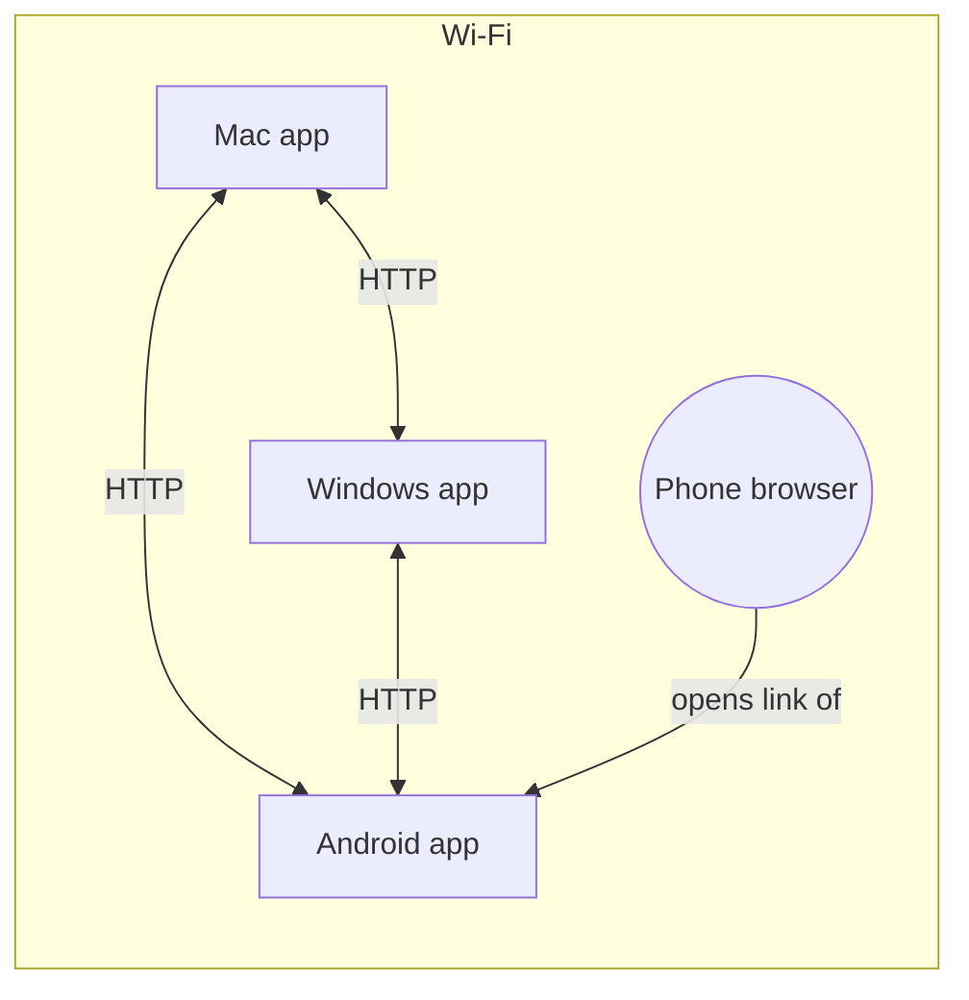

# Nearby-device protocol (v1)

How Open Transfer apps find each other, pair, and send files **directly** to
the devices a person picks. Anything that speaks this protocol can join a
network of Open Transfer devices — the desktop apps, the Android app and the
CLI all run the same Python implementation (`discovery.py`, `mesh.py`,
`mesh_api.py`).

## Roles

| Term | Meaning |
| ---- | ------- |
| **app** | A device running Open Transfer. Has a stable id (`d-` + 24 hex), an HTTP server, and announces itself. |
| **owner** | The person using an app on that device — requests from `127.0.0.1`. Accepts or declines incoming files. |
| **visitor** | A browser on a device *without* the app (opened an app's link / QR code). Gets an id `w-…` in a signed session cookie. The app it opened sends and receives on its behalf. |



Apps talk to each other directly. A visitor's files travel visitor → its app
→ receiver (one hop through the app it is connected to).

## 1. Discovery (UDP multicast)

* Group `239.255.77.77`, port `47823` (admin-scoped, TTL 1 — never leaves the LAN).
* Every app sends an **announce** on start (3× within 1.5 s), then every ~4 s,
  and a **bye** when it stops. When it sees a new app it answers with a
  **reply** (at most once a second) and says hello over HTTP (§2).
* Datagrams are UTF-8 JSON, at most 1400 bytes:

```json
{"app": "open-transfer", "v": 1, "type": "announce",
 "id": "d-3f…", "name": "Sonu’s MacBook", "form": "computer", "platform": "macos",
 "port": 5000, "rev": 7, "ver": "3.0.0"}
```

`type` is `announce` | `reply` | `find` | `bye`. The peer's address is the
datagram's **source IP**, never a field in the packet. `rev` changes when the
app's visitors or name change, prompting others to fetch its info.

**find** — "whoever is showing this pairing code, answer":
`{"type": "find", "id": "d-…", "find": "<hint>"}` where
`hint = sha256("open-transfer-find/1\n" + code)[:16]`. The app showing that
code sends a `reply` with `"found": "<hint>"`.

Multicast is often blocked (guest Wi-Fi, some routers, Docker). So apps also:

* say **hello** over HTTP to every known app every 6 s (keeps presence alive
  even if multicast only works one way), and
* can be added by address (`POST /api/devices`, `--peer HOST:PORT`).

An app is *nearby* while it was heard from in the last 15 s; unpaired apps are
forgotten after 2 minutes, paired ones stay listed as "Not nearby".

## 2. App ↔ app HTTP API

All under `/api/p2p/v1`, JSON unless noted. No PIN is needed (the PIN guards
the web UI); every transfer still needs the receiver's consent. Requests
between **paired** apps carry a signature (§4).

| Request | Purpose |
| ------- | ------- |
| `GET /info` | `{id, name, form, platform, port, version, accepts, visitors: [{id, name, form, platform}]}` (visitors hidden when a PIN is set and the caller isn't paired) |
| `POST /hello` body = caller's info | Registers the caller (address = TCP peer address); returns `/info` |
| `POST /offers` | Offer files (below) → `201 {id, secret, state, reason}` (`reason` says why, when it is declined straight away) |
| `GET /offers/<id>` + `X-OT-Secret` | `{state, reason, files: [{state, received}]}` |
| `PUT /offers/<id>/files/<n>` + `X-OT-Secret`, `Content-Length` | Raw file bytes → `201 {file}` |
| `DELETE /offers/<id>` + `X-OT-Secret` | Sender cancels |
| `POST /pair`, `POST /pair/confirm` | Pairing (§3) |

### Offer

```json
POST /api/p2p/v1/offers
{"from":   {"id": "d-sender…", "name": "Gaming PC", "form": "computer", "platform": "windows", "port": 5000},
 "origin": {"id": "w-visitor…", "name": "Pixel 8", "form": "phone", "platform": "android"},
 "to":     "d-receiver…",
 "files":  [{"name": "IMG_0001.jpg", "size": 2481331, "mime": "image/jpeg"}]}
```

* `from` is the app making the request; `origin` is who is actually sending
  (the app's owner, or one of its visitors).
* `to` is the receiving app's own id (its owner) **or one of its visitors**.
* Names are sanitised by the receiver; sizes are checked against free space
  and `--max-size` up front (`state: "declined"` with a reason if they don't fit).

**States** (wire names; history and `lifecycle.py` call them offered →
accepted → transferring → completed): `pending` → `accepted` → `receiving` →
`done`, or `partial` (some files arrived), `failed`, `declined`, `expired`,
`canceled`. Offers to an owner from a paired app (and with `--auto-accept`)
start as `accepted`. With `--paired-only`, offers from unpaired apps are
refused (`403`). A final state never changes; late or repeated messages are
refused (`409`/`410`) or ignored.

Every unhappy ending carries a `reason_code` (see `REASONS` in
`src/open_transfer/lifecycle.py`: `receiver_declined`, `insufficient_storage`,
`file_too_large`, `permission_denied`, `sender_cancelled`, `receiver_cancelled`,
`sender_disconnected`, `receiver_disconnected`, `receiver_unreachable`,
`network_timeout`, `transfer_stalled`, `expired`, `app_closed`, `app_restart`,
`destination_unavailable`, `invalid_request`, `unknown_failure`), plus a human
`reason` and a suggested `action`.

**Deadlines** (checked every 2 s on both sides):

| State | Deadline | Ends as |
|---|---|---|
| `pending` | 120 s without an answer (sender: 135 s) | `expired` / `expired` |
| `accepted` | 90 s without a first byte | `failed` / `sender_disconnected` |
| `receiving` / sending | 60 s without any data | remaining files `failed` / `transfer_stalled` → `partial` or `failed` |
| anything active at start-up | immediately | `failed` / `app_restart` |

**Who decides.** The receiver is authoritative for *accepted*, *a file
arrived* and the final state of what it received. The sender polls
`GET /offers/<id>` until the offer leaves `pending`, then uploads each file with
`PUT`. Before it records a failure it can't prove on its own (a lost reply, a
deadline, a cancel racing the last byte) it asks `GET /offers/<id>` (answered
for 10 min after the end, with each file's `state` and `reason_code`) and
adopts the receiver's answer; only if the receiver can't be reached does it
record `receiver_disconnected`. So a file that arrived is never recorded as
failed by the sender.

**Recovery.** v3 never resumes: a transfer that breaks ends `failed` or
`partial` with a reason, and *retry* sends the missing files again from the
start. Sender or receiver disconnect, Wi-Fi drop, a phone suspending the app
and a device restart all end through the deadlines above (or sooner when a
connection error is certain); short hiccups that don't stop the data for 60 s
are ridden out by TCP. **Closing the app** during a transfer is a failure, not
a cancel: `failed`/`app_closed` on that device, and the other side is told
(`DELETE /offers/<id>` with `X-OT-Reason: app_closed` → `failed`/
`sender_disconnected`). A crash ends as `app_restart` on the next start.

The receiver streams each file to a `.part` file and publishes it atomically;
the byte count must equal the offered size, and a partial file is deleted.

### One-to-many

The sender's own browser uploads each file **once** to its app
(`PUT /api/send/<job>/files/<n>`). The app streams the bytes to every
accepting receiver at the same time — each receiver has its own thread and a
bounded queue; a receiver that takes no data for 60 s is dropped without
stalling the others. Nothing is staged on the sender's disk.

**Group accounting.** A send to several devices is one transfer (one
`transfer_id`, one history record) with an independent result per recipient:
its own state, `reason_code`, `files_done`, `files_failed` (`{"<index>": code}`),
`started_at`/`finished_at` and `disconnected` (the reason is a drop-out, not a
choice). A recipient's state only changes through its own delivery, so one
receiver declining, failing or being canceled never changes another's. The
parent's state is `aggregate_state()` over the recipients
(`src/open_transfer/history.py`):

* someone still active → the least advanced state among those who have
  engaged (accepted/transferring), else `offered`;
* everyone `completed` → `completed`;
* at least one `completed`/`partial`, not all `completed` → `partial`;
* nobody received anything → their shared ending; when they differ, the first
  of `failed` > `cancelled` > `expired` > `declined`.

`GET /api/state` (`outgoing[]`) and `GET /api/history` both carry
`summary: {state, total, delivered, pending, accepted, transferring, completed,
partial, failed, declined, expired, cancelled, disconnected}`, so a UI can say
"Delivered to 2 of 3" without combining endpoints. Canceling one recipient
(`DELETE /api/send/<job>/targets/<id>`, also "Send now") stops only that
stream; canceling the job (`DELETE /api/send/<job>`) reaches every active
recipient.

### Browser to browser (WebRTC)

When the receiver is a **browser** (a visitor) and the sender is a page too
(any visitor, or an app's own window), the file goes **straight between the two
browsers** over a WebRTC data channel; the apps only carry the two connection
messages:

```
sender page → its app        POST /api/signal {job, target, kind: "offer", sdp}
  its app → receiver's app   POST /api/p2p/v1/signal {dir: "to_receiver", session, secret, …}
receiver page ← its app      GET  /api/signals            (announced by "signals": n in /api/state)
receiver page → its app      POST /api/signal {session, kind: "answer", sdp}
  … → sender's app           POST /api/p2p/v1/signal {dir: "to_sender", job, target, secret, …}
```

* Messages are only accepted for a transfer the receiver **already accepted**,
  and only from its two ends: app-to-app messages carry the offer's secret.
* No STUN/TURN servers: on a LAN the devices reach each other directly
  (browsers' mDNS `.local` candidates included).
* The data channel carries `{"t":"file", i, name, size, mime}`, raw 64 KiB
  chunks with back-pressure, `{"t":"end", i}`; the receiver answers
  `{"t":"done", i}` and reports progress to its app
  (`POST /api/incoming/<id>/direct`). The sender reports its side with
  `POST /api/send/<job>/targets/<id>/direct` (`trying` / `progress` / `done` /
  `failed`); while a target is `trying` the app doesn't stream to it.
* **Fallback:** if no connection opens within ~12 s or it breaks, the sender
  reports `failed` and the file goes through the apps as usual.
* The received file stays in the receiving browser (a `Blob`) until saved, so
  direct transfers are capped at 1 GB; larger ones go through the apps.

## 3. Pairing

The full model (identities, keys, what each message proves, limitations) is in
[trust-model.md](trust-model.md). In short: A shows a 6-digit code while its
*Add device* screen is open; B enters or scans it; they run **SRP-6a** (RFC
5054, 2048-bit group, SHA-256) with the code as the password; A's owner presses
*Allow*; both store a pair key derived from the SRP session key.

```
A (owner)  POST /api/pair/open                       → opens the window (30 s, renewed by the page)
B → A      POST /pair/begin  {device: B-info}        → {session, salt, b: B_pub, device: A-info}
B → A      POST /pair/prove  {session, a: A_pub, m1} → {m2}        (wrong code: 403 pairing_code_invalid)
A (owner)  "Pair with B?"  POST /api/pair/requests/<session>/allow|deny
B → A      POST /pair/status {session, mac}          → {status: confirming|allowed|denied|expired, mac}
pair key   HMAC-SHA256(K, "open-transfer-pair-key/2|idA|idB")
```

* SRP identity: `idA|idB`. `mac` values are HMAC(K, …) so only the two
  participants can poll or answer. The code is accepted only while the window
  is open; 5 wrong attempts per minute per address, a new code after 10 wrong
  guesses, after each pairing and every 10 minutes; a session is single-use.
* **Finding A without multicast:** B asks only the chosen device (`device_id`),
  the device at `address`, or every reachable device whose hello/info says
  `pairing: true`, plus devices answering a multicast `find` (which carries no
  code data; answers are also sent back by unicast). Errors:
  `discovery_unavailable`, `pairing_not_open`, `pairing_code_invalid`,
  `pairing_expired`, `trust_rejected`, `device_unreachable`, `rate_limited`
  (with `retry_after`), `already_paired`, `identity_mismatch`.
* **QR code:** `http://<ip>:<port>/?pair=<code>&id=<device id>` — temporary only,
  never the PIN. The app scans it and pairs with that device; a phone camera
  opens it, which (while the window is open) admits that browser like the PIN
  would and marks it a **trusted visitor**.
* **Unpair:** `DELETE /pair`, signed, removes the key on both sides; a device
  that was offline learns it from `X-OT-Unpaired` on its next signed request.

## 4. Signed requests and answers

Requests from a paired app carry:

```
X-OT-From: d-sender…
X-OT-Auth: <unix time>.<16-hex nonce>:<hex HMAC-SHA256(key, "open-transfer/2\n<time.nonce>\n<METHOD>\n<path>\n<sender>\n<sha256(body)>")>
```

Receivers accept signatures within ±120 s and refuse one they have already
seen. Their **answer** carries `X-OT-Auth: HMAC(key, "open-transfer/1\nresponse\n<request X-OT-Auth>\n<status>\n<sha256(body)>")`;
a paired app treats an answer without a valid one as coming from someone else.
A valid signature makes an offer from that app's owner auto-accepted; anything
else is treated as a stranger (asked first). A paired device's address only
changes after it has answered a signed hello at the new address (or sent one).

## Security notes and limits

* **Transport is plain HTTP on the LAN.** Pairing authenticates devices and
  protects against tampering with *who* is sending, but file contents are not
  encrypted in transit — anyone who can capture traffic on your Wi-Fi could
  read them. Use networks you trust, a PIN for the web UI, and paired-only mode
  on shared networks. TLS with pinned per-device certificates is on the roadmap.
* Browser → browser goes direct (WebRTC, see above). Browser → app and
  app → browser-on-another-app still pass through the app the browser opened.
* No resume: an interrupted file restarts from zero (retry re-offers it).
* Folders aren't sent as folders — zip them first.
